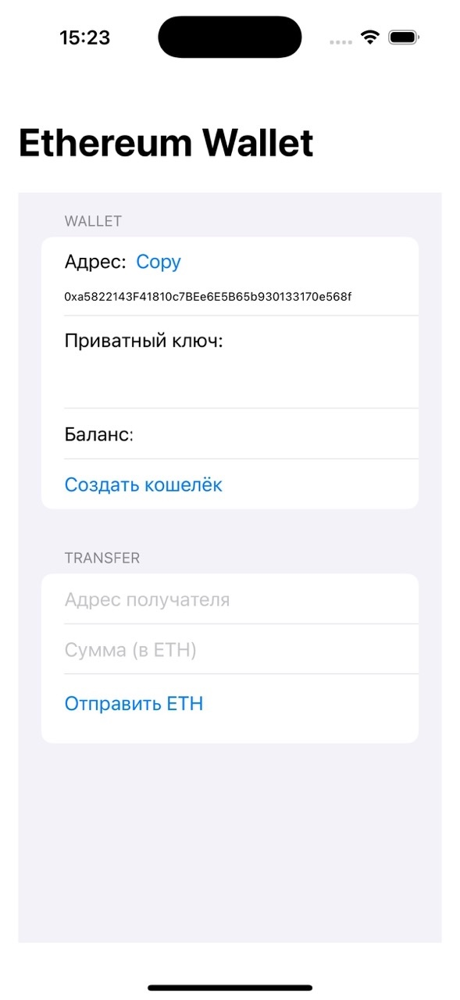

# Ethereum wallet

SwiftUI web3swift Ethereum Wallet creation, balance and send operations

A lightweight and secure Ethereum wallet for iOS and macOS, designed to simplify interactions with the Ethereum blockchain. This project allows users to create wallets, manage ETH and ERC-20 tokens, and send transactions securely using modern Swift and Web3 technologies.

## Table of Contents
- [Features](#features)
- [Screenshots](#screenshots)

## Features
- Generate and manage Ethereum wallets with Hierarchical Deterministic (HD) keys.
- Send and receive ETH and ERC-20 tokens.
- Connect to Ethereum networks (Mainnet, Ropsten, etc.) via Infura or custom nodes.
- Secure key storage using iOS/macOS Keychain.
- User-friendly interface for blockchain interactions.
- Offline transaction signing for enhanced security.

## Screenshots
Explore the app's interface with these screenshots:

| Wallet Dashboard |
|------------------|
|  |

## Requirements
- **Xcode**: Version 15.0 or later
- **iOS**: 16.0 or later
- **macOS**: 13.0 or later
- **Dependencies**:
  - Swift Package Manager for Web3.swift and other libraries
  - An Infura API key or Ethereum node URL for blockchain access
- **Hardware**: Optional support for Ledger/Trezor hardware wallets (if implemented)

